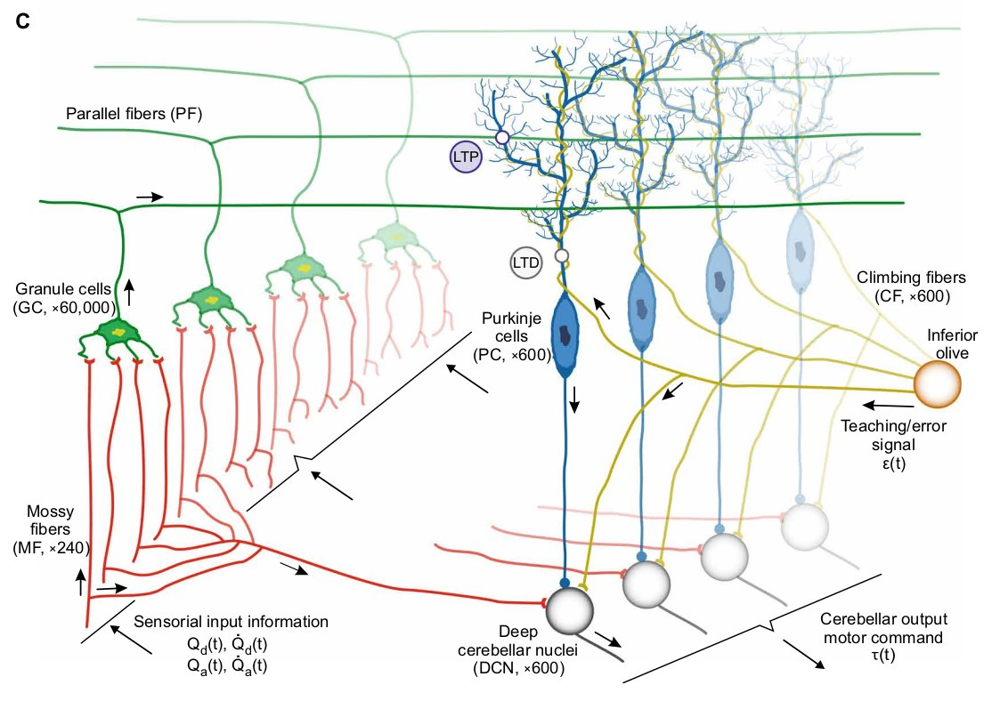
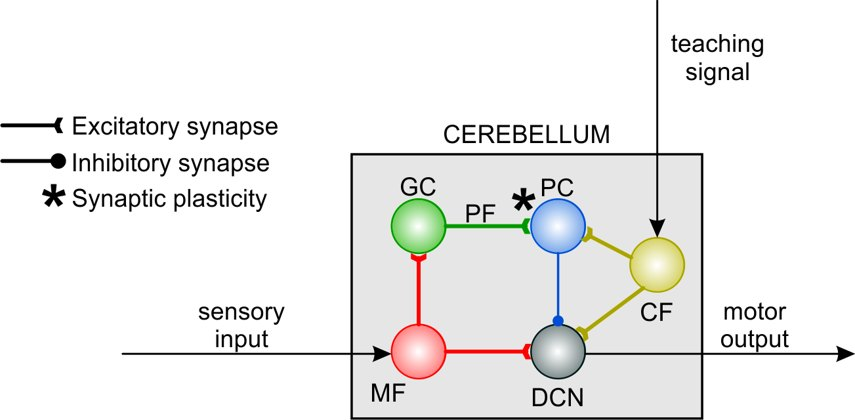
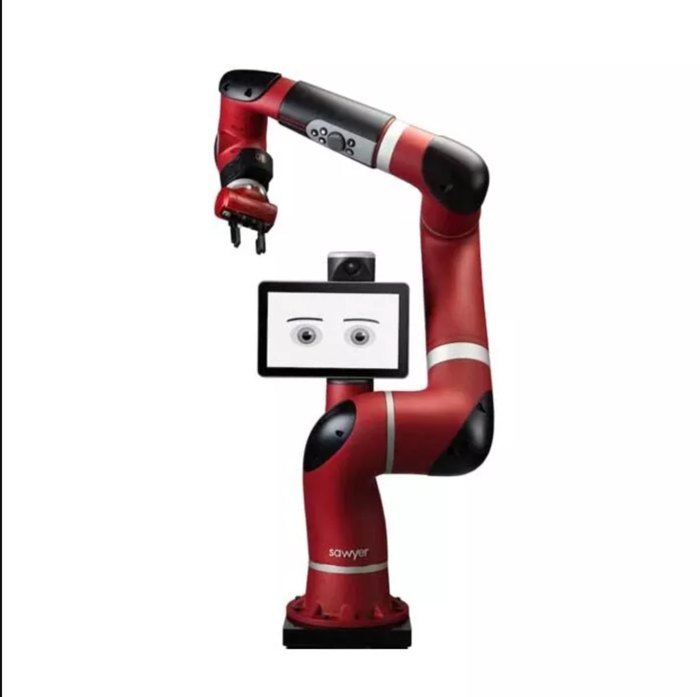
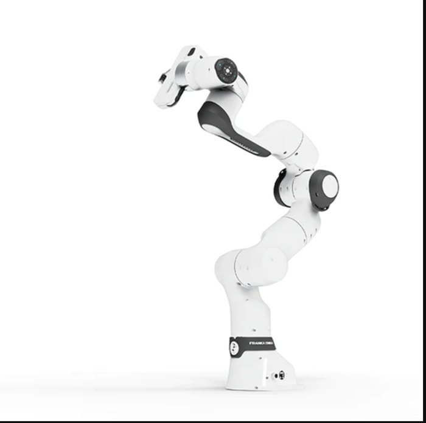
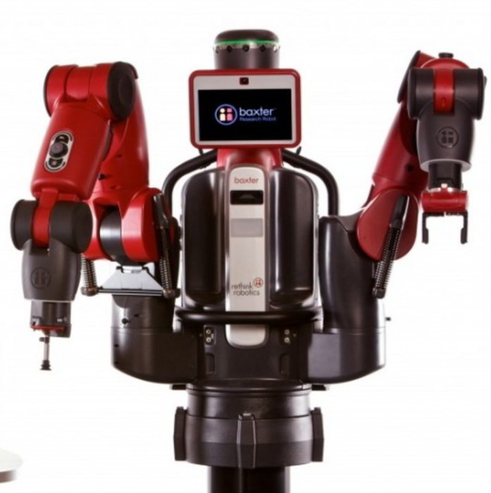
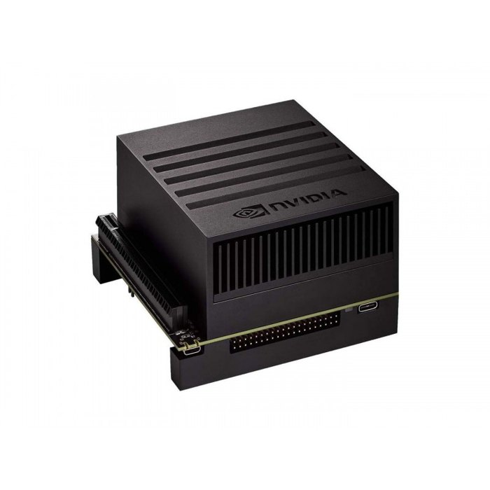

<a href="../">← All projects</a>

Project 1 · Neurorobotics

# Cerebellar SNN: motor learning from simulation to real robots

A 70,000-neuron cerebellum model that learns torque control in simulation, then finishes learning on real robots by switching a single ROS topic.

ROSEDLUTGazeboNeurorobotics PlatformGPUJetson Xavier / OrinVicon

| | |
|---|---|
| **Model** | Spiking neural network (SNN) mirroring the cerebellar circuit, 70,000+ neurons |
| **Output** | Joint torque command, so real-time and safety constraints apply |
| **Robots** | Franka Research 3, Baxter, Sawyer |
| **Compute** | Desktop PC with GPU, Jetson Xavier, Jetson Orin |
| **Control rate** | PC 500 Hz · Jetson Orin 250 Hz · Jetson Xavier 100 Hz |
| **Sim-to-real** | ~450 trials (~30 min) in simulation, then ~80 trials on the real robot until the error converged |
| **My role** | Simulator bridge, Jetson port, torque-safety layer, real-robot experiments |

<figure><video src="../../assets/video/franka_circle.mp4" poster="../../assets/video/franka_circle.jpg" autoplay loop muted playsinline></video><figcaption>Franka Research 3 driven by the SNN on a Jetson Xavier, circular trajectory</figcaption></figure>
<figure class="tall"><video src="../../assets/video/baxter.mp4" poster="../../assets/video/baxter.jpg" autoplay loop muted playsinline></video><figcaption>Baxter, the hardest of the three robots</figcaption></figure>

## 1. The idea: copy the cerebellum

The cerebellum plays a central role in motor coordination and in error-driven adaptation. Taking inspiration from its structure, I used a spiking neural network for motor learning. Its layers mirror the cerebellar circuit: **mossy fibers, granule cells, Purkinje cells, climbing fibers and deep cerebellar nuclei**.

The network learns when it receives two kinds of signals: sensory input and an **error (teaching) signal**. The learning is supervised and works much like how we get better at drawing a closed shape the more often we repeat it: the network improves by repeating a movement. The model contains more than **70,000 neurons**, and its output is a **torque signal**. That single fact drives most of the engineering in this project: it has to run in real time, on a GPU, and with safety mechanisms.

<figure><figcaption>Cerebellar microcircuit: parallel fibers, granule, Purkinje and nuclear cells</figcaption></figure>
<figure><figcaption>The simplified model: sensory input, teaching signal, motor output</figcaption></figure>

## 2. One bridge between two simulators

A physics simulator such as **Gazebo** and a spiking-network simulator such as **EDLUT** cannot talk to each other natively. I worked with the **Neurorobotics Platform (NRP)**, a ROS-compatible platform through which the two simulators communicate. Because it is compatible with ROS, **moving to hardware is very simple**: the network keeps sending torques, and only the ROS topic changes.

The clip shows the network controlling the simulated arm. After repeating a movement many times, for example a closed trajectory, the system performs it better. The plots at the top track **position and velocity error** to verify learning, and the plots at the bottom show the **activations of some neuron layers**.

<figure><video src="../../assets/video/sim_error.mp4" poster="../../assets/video/sim_error.jpg" autoplay loop muted playsinline></video><figcaption>Simulated arm learning a trajectory: error plots (top) and layer activity (bottom)</figcaption></figure>

!!! note "Why simulate first"
    Simulation is where there is the most control over everything. Early in learning, movements can be violent and would damage the real motors, through collisions or sudden changes in motor direction. Learning starts in simulation for that reason.

## 3. One neural controller, three robots, one embedded platform

The goal was a **general solution**, so I tested collaborative robots with different dynamics. All three have dynamics that are not completely rigid, because of some elastic components. **Baxter**, with its external springs, is the hardest to learn.

<figure class="sq"><figcaption>Sawyer</figcaption></figure>
<figure class="sq"><figcaption>Franka Research 3</figcaption></figure>
<figure class="sq"><figcaption>Baxter</figcaption></figure>
<figure class="sq"><figcaption>NVIDIA Jetson Xavier / Orin</figcaption></figure>

Because the output of the cerebellum is a torque signal, the work comes with four constraints:

- **Real time** at the highest frequency possible.
- **GPU use and parallelization** to run the SNN in real time.
- **Safety mechanisms** to operate in torque.
- **An embedded target**: I ran it on both a Jetson Xavier and a Jetson Orin.

## 4. Experimental setup

Network host<small>Desktop PC or Jetson Xavier / Orin runs the SNN</small>

⟶<small>torque commands</small>

Robot<small>Franka Research 3 · Baxter · Sawyer</small>

⟶<small>end-effector pose</small>

Vicon cameras<small>independent ground truth</small>

Monitoring PC<small>live plots only, so it does not load the network host</small>

- A **separate PC** is used only for plotting and monitoring, so it does not consume resources of the machine that runs the network.
- A **Vicon** camera system verifies the Cartesian position of the end effector, independently of the robot's own sensors.
- Every link goes through **ROS topics**, so simulation and hardware share one interface.

| Network host | Control frequency |
|---|---|
| Desktop PC | 500 Hz |
| Jetson Orin | 250 Hz |
| Jetson Xavier | 100 Hz |

<figure><video src="../../assets/video/live_setup.mp4" poster="../../assets/video/live_setup.jpg" autoplay loop muted playsinline></video><figcaption>Monitoring screen during an experiment</figcaption></figure>

## 5. Results on real hardware

The cerebellum running on the Jetson Xavier controls the **Franka Research 3** along a circular trajectory. Three things are worth keeping in mind when reading this result:

1. The cerebellum controls at **joint level**, so validating only with a Cartesian trajectory under-represents what it does.
2. On the Jetson, because of hardware limits, I **reduced the network size and the operating frequency**, which means a loss of learning resolution.
3. These are **collaborative robots, not precision robots**.

The second clip is a random execution controlling **Baxter**, the hardest of the three: its external springs make its dynamics much more challenging to learn.

## 6. Sim-to-real: how the transfer works

<figure><video src="../../assets/video/sim2real_1.mp4" poster="../../assets/video/sim2real_1.jpg" autoplay loop muted playsinline></video><figcaption>1 · Learning starts in simulation: erratic movements that could be very harmful for the motors</figcaption></figure>
<figure><video src="../../assets/video/sim2real_2.mp4" poster="../../assets/video/sim2real_2.jpg" autoplay loop muted playsinline></video><figcaption>2 · Once learning is reasonably stable, the weights are saved</figcaption></figure>
<figure><video src="../../assets/video/sim2real_3.mp4" poster="../../assets/video/sim2real_3.jpg" autoplay loop muted playsinline></video><figcaption>3 · The same network is loaded on the real robot by changing only the ROS topic</figcaption></figure>
<figure><video src="../../assets/video/sim2real_4.mp4" poster="../../assets/video/sim2real_4.jpg" autoplay loop muted playsinline></video><figcaption>4 · After ~80 more trials the error converges</figcaption></figure>

1. **Learning starts in simulation**, where erratic movements cannot damage anything.
2. Once learning has stabilized, without over-calibrating the network, I **save the weights** to finish learning on the real robot. The trajectory lasts 4 seconds, so ~450 trials means saving the weights after about **30 minutes**.
3. I **load the network on the real robot**, changing only the ROS topic thanks to NRP. The movements are safer and learning can continue.
4. After another **~80 trials the error converges** to a value. These values can be improved by tuning the network parameters, but tuning was not the goal of this work: the goal was the integrated, safe pipeline.

## 7. Scope, trade-offs and lessons

Deliberate trade-offs

- **Jetson:** reduced network size and update rate to fit the hardware, accepting lower learning resolution.
- **Joint-level learning,** validated in Cartesian space with Vicon as an independent ground truth.
- **Collaborative robots:** the aim was a general, transferable controller that learns complex dynamics.
- **Tuning** kept out of scope to focus on the integrated pipeline.

What I took from it

- **Simulate first,** then switch a single ROS topic: hardware risk drops sharply.
- **Torque control needs a safety layer by design,** not as an afterthought.
- **Real-time GPU spiking inference** is a systems problem as much as a modeling one.

<a href="../">← All projects</a><a href="../dual-actuation-arm/">Next: Dual-actuation arm →</a>

