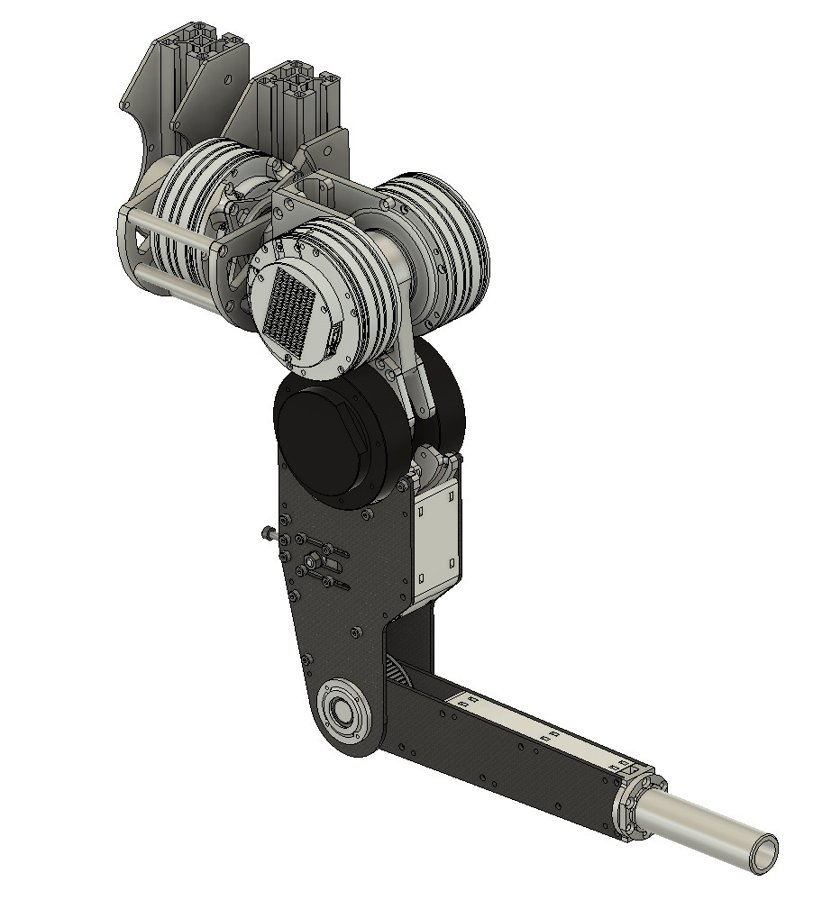

<a href="../">← All projects</a>

Project 2 · Robot software

# Dual-actuation arm: remote high-level interface

Software that lets neural controllers drive a research arm with muscle-like actuators from another computer, at 1 kHz.

RustZenohROS 2Raspberry Pi 41 kHzTorque control

| | |
|---|---|
| **Robot** | Research prototype with two actuators per joint (agonist and antagonist), designed from scratch |
| **Challenge** | Its Raspberry Pi 4 only supports low-level control, so neural controllers cannot run on board |
| **My role** | Software for the high-level interface in ROS 2, and the remote command link |
| **Stack** | Rust + Zenoh transport, ROS 2 interface |
| **Targets** | 1 kHz loop, torque control |
| **Context** | EPFL BioRobotics Laboratory visit (2025), with KM-RoBoTa on the hardware deployment |

## A research arm with two actuators per joint

Each joint has an **agonist and an antagonist actuator**, trying to imitate our muscles. Like muscles, a pair of opposing actuators allows dynamics such as **adjustable arm stiffness**. The robot was designed from scratch, and the project went through two hardware iterations.

<figure><figcaption>Alpha version</figcaption></figure>
<figure><figcaption>New version (CAD)</figcaption></figure>

## My part: a high-level interface over the network

The arm is controlled by a **Raspberry Pi 4**, which only allows controlling it at low level. My objective was to develop software so **commands can be sent remotely**, which makes it possible to control the arm with **neural controllers** that cannot be implemented on the on-board controller because of hardware limits.

Remote PC<small>ROS 2 + neural controllers</small>

⇄<small>Zenoh</small>

Raspberry Pi 4<small>low-level control, 1 kHz</small>

⇄

Dual-actuation arm<small>agonist / antagonist actuators</small>

I built the interface with **Zenoh in Rust**, keeping the target applications in mind:

- **Operating at 1 kHz.**
- **Torque control.**
- The **data that has to travel between computers**: forward and inverse kinematics, commands and so on.

## Stiffness in action

The clip shows the same trajectory performed twice: first **without stiffness**, then **with stiffness**. It is a direct demonstration of the dynamics that the agonist/antagonist design makes possible, and of controlling the arm through the remote interface.

<figure class="tall"><video src="../../assets/video/stiffness_demo.mp4" poster="../../assets/video/stiffness_demo.jpg" controls loop muted playsinline></video><figcaption>Same trajectory: ① without stiffness, then ② with stiffness</figcaption></figure>

<a href="../cerebellar-snn/">← Previous: Cerebellar SNN</a><a href="../tiago-pro/">Next: TIAGo Pro →</a>

