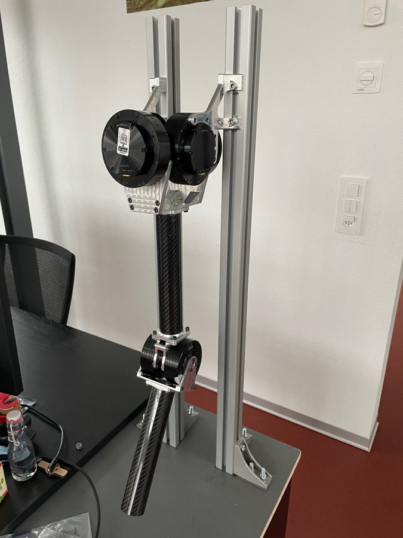
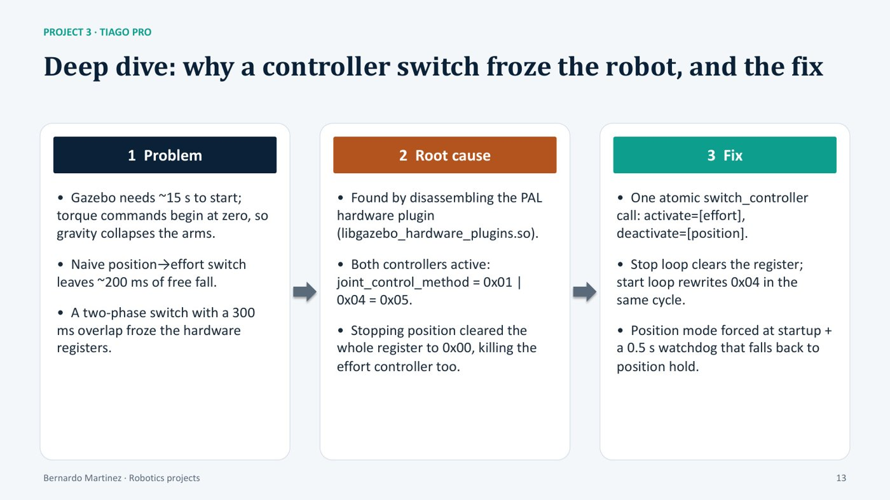
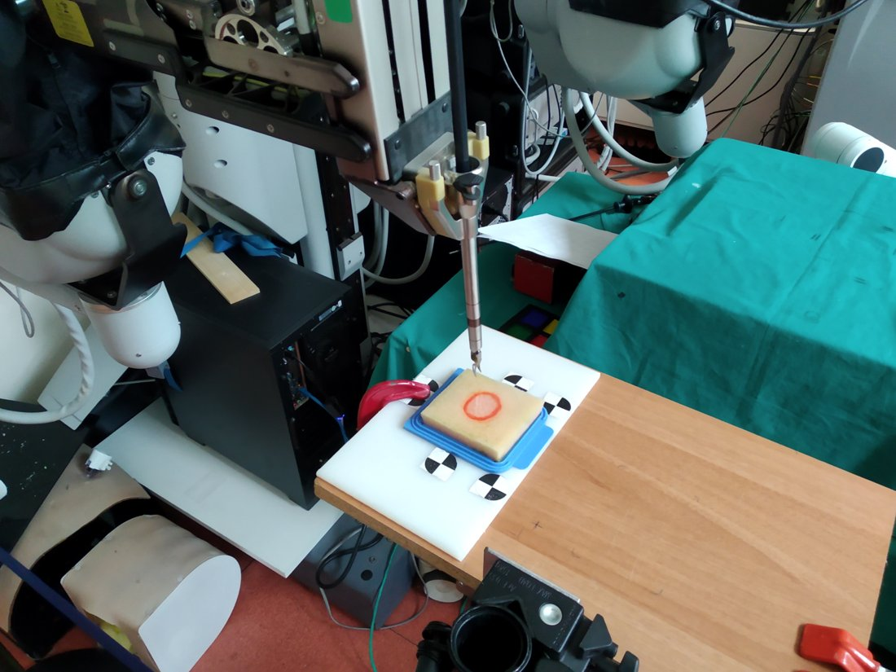
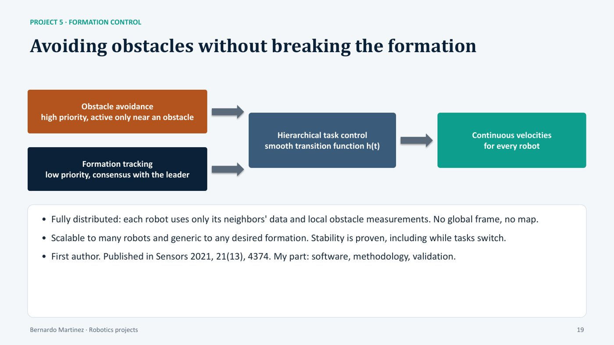

# Projects

Five projects, one path: from algorithm to real robot. Click a title for the full story of each project.

Project 1 · Neurorobotics

## [Cerebellar SNN: motor learning from simulation to real robots](cerebellar-snn.md)

A 70,000-neuron cerebellum model that learns torque control and moves to real robots by switching one ROS topic.

<figure><video src="../assets/video/franka_circle.mp4" poster="../assets/video/franka_circle.jpg" autoplay loop muted playsinline></video><figcaption>Franka Research 3 driven by the SNN on a Jetson Xavier, circular trajectory</figcaption></figure>
<figure class="tall"><video src="../assets/video/baxter.mp4" poster="../assets/video/baxter.jpg" autoplay loop muted playsinline></video><figcaption>Baxter, the hardest case (elastic joints)</figcaption></figure>

<figure><video src="../assets/video/sim2real_1.mp4" poster="../assets/video/sim2real_1.jpg" autoplay loop muted playsinline></video><figcaption>1 · Learning starts in simulation: erratic, potentially damaging motions</figcaption></figure>
<figure><video src="../assets/video/sim2real_2.mp4" poster="../assets/video/sim2real_2.jpg" autoplay loop muted playsinline></video><figcaption>2 · Once stable, weights are saved (~450 trials, ~30 min)</figcaption></figure>
<figure><video src="../assets/video/sim2real_3.mp4" poster="../assets/video/sim2real_3.jpg" autoplay loop muted playsinline></video><figcaption>3 · Weights loaded on the real robot by changing only the ROS topic</figcaption></figure>
<figure><video src="../assets/video/sim2real_4.mp4" poster="../assets/video/sim2real_4.jpg" autoplay loop muted playsinline></video><figcaption>4 · After ~80 more trials, the error converges</figcaption></figure>

- **Challenge:** learn arm control in torque, in real time and safely, on robots with different dynamics.
- **My work:** Gazebo–EDLUT bridge (Neurorobotics Platform), SNN on GPU including Jetson Xavier/Orin, torque-safety layer, real-robot tests on Franka Research 3, Baxter and Sawyer with Vicon ground truth.
- **Result:** ~450 trials (~30 min) in simulation, then ~80 trials on the real robot until the error converged.
- **Control rate:** PC 500 Hz · Jetson Orin 250 Hz · Jetson Xavier 100 Hz.

<a href="cerebellar-snn/">Read the full story →</a>

ROSEDLUTGazeboNeurorobotics PlatformGPUJetsonVicon

Project 2 · Robot software

## [Dual-actuation arm: remote high-level interface](dual-actuation-arm.md)

Lets neural controllers drive a research arm with muscle-like actuators from another computer.

<figure><figcaption>Alpha version</figcaption></figure>
<figure><figcaption>New version (CAD)</figcaption></figure>
<figure class="tall"><video src="../assets/video/stiffness_demo.mp4" poster="../assets/video/stiffness_demo.jpg" autoplay loop muted playsinline></video><figcaption>Same trajectory: ① without, then ② with stiffness</figcaption></figure>

- **Challenge:** each joint has agonist and antagonist actuators (adjustable stiffness), but its Raspberry Pi 4 only handles low-level control.
- **My work:** high-level interface in ROS 2 and a Rust + Zenoh link for remote commands, targeting 1 kHz torque control and exchanging kinematics and commands.
- **Result:** neural controllers run off-board; the clip shows the same trajectory without, then with stiffness.
- **Context:** EPFL BioRob visit (2025), with KM-RoBoTa on the hardware deployment.

<a href="dual-actuation-arm/">Read the full story →</a>

RustZenohROS 2Raspberry Pi

Project 3 · Mobile manipulation

## [TIAGo Pro: a ROS 2 torque interface for both arms](tiago-pro.md)

The robot exposed no torque interface to users, so I built one: a ROS 2 interface to the arm controllers with a state machine that allows one controller per arm. Running on the real robot at 500 Hz.

<figure class="tall"><video src="../assets/video/tiago.mp4" poster="../assets/video/tiago.jpg" autoplay loop muted playsinline></video><figcaption>Torque control on the real TIAGo Pro</figcaption></figure>
<figure><figcaption>Making mode switches safe: problem, root cause and fix</figcaption></figure>

- **Challenge:** no torque interface was exposed to the user through ROS 2 topics.
- **My work:** the ROS 2 interface to the arm controllers, plus a state machine that allows only one controller (position, velocity or torque) per arm at a time. MoveIt 2 for planning, Docker for the environment.
- **Safe switching:** found a hardware-plugin bug by disassembling its binary. Fix: one atomic `switch_controller` call, position hold at startup, 0.5 s watchdog fallback.
- **Software:** ROS 1 → ROS 2 / MoveIt 2 migration, parametric `arm_{side}` topics, 4 scripts merged into 1 dispatcher, full-body controllers.

<a href="tiago-pro/">Read the full story →</a>

ROS 2ros2_controlMoveIt 2GazeboDockerC++Python

Project 4 · Medical robotics

## [Tumor localization by bioimpedance palpation](tumor-localization.md)

Tumor shape recovered by touch with only 25–50% of the samples (recall above 90%).

<figure><figcaption>dVRK PSM2 and sponge phantom with fiducial markers</figcaption></figure>
<figure><figcaption>Ground truth vs active area search (RViz + MATLAB)</figcaption></figure>

<figure><figcaption>Ground truth: exhaustive impedance map</figcaption></figure>
<figure><figcaption>Estimate from a fraction of the samples</figcaption></figure>

- **Challenge:** locate and outline a tumor without computer vision, for minimally invasive surgery.
- **My work:** dVRK PSM2 palpation with an electrical bioimpedance probe; ROS/RViz simulation and EBI sensor emulator (20×20 grid); Gaussian Process active area search in MATLAB; RealSense point cloud and fiducials for 3D validation.
- **Result:** the estimate matches the exhaustive ground truth. Tested on a sponge phantom (soap and water for impedance contrast).

<a href="tumor-localization/">Read the full story →</a>

dVRKROSRVizMATLABGaussian ProcessRealSense

Project 5 · Multi-robot systems · Published

## [Formation control with obstacle avoidance](formation-control.md)

Robots keep a formation and avoid obstacles, with continuous velocities at all times.

<figure><figcaption>Core idea: obstacle avoidance (high priority) over formation tracking (low priority), with a smooth transition</figcaption></figure>

- **Core idea:** two prioritized tasks. Obstacle avoidance (high priority, active only near obstacles) over formation tracking (low priority, consensus). A smooth transition keeps velocities continuous.
- **Distributed:** neighbor data and local obstacle sensing only. No global frame, no map. Stability proven.
- **Real robots:** Pioneer 3DX leader + 2 TurtleBot 2, triangular formation, ROS over WiFi, OptiTrack.
- **Linear trajectory (30 s):** a follower evades a fixed obstacle at ~18 s; the group recovers the formation.
- **Circular trajectory (R 1.1 m, 70 s):** evasion at ~53–65 s; tracking errors converge to zero.
- **My role:** first author; software, methodology, validation. Later migrated the full stack to ROS 2 and Gazebo Sim (Harmonic).

<a href="https://drive.google.com/file/d/1RVNe52Gh6gmc2AtGyeuERfKY54dixHz-/view">▶ Video: linear trajectory</a>
<a href="https://drive.google.com/file/d/1bJZBO7dByTipDryC0XqHJurHE4f-d_i1/view?usp=sharing">▶ Video: circular trajectory</a>
<a href="https://www.mdpi.com/1424-8220/21/13/4374">📄 Paper (Sensors 2021)</a>

<a href="formation-control/">Read the full story →</a>

ROSROS 2Consensus controlOptiTrackTurtleBot 2Gazebo Harmonic

