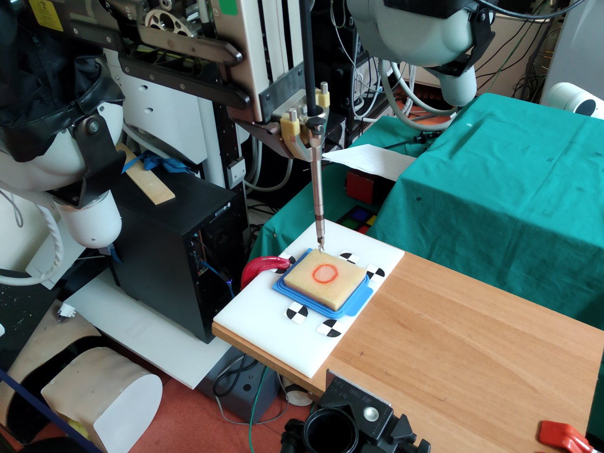
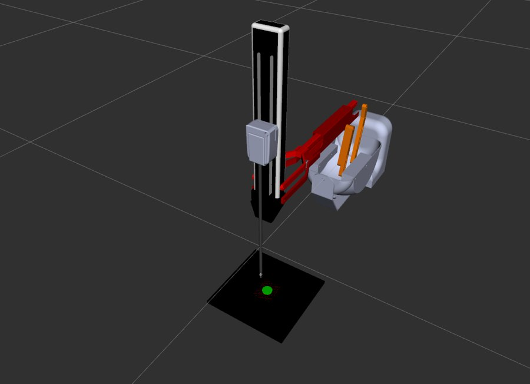
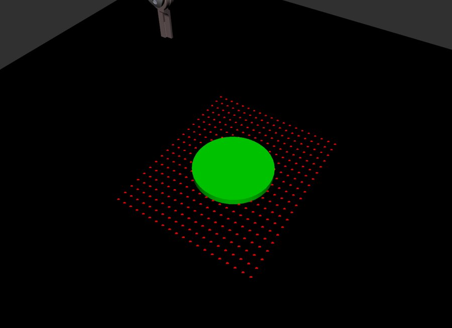
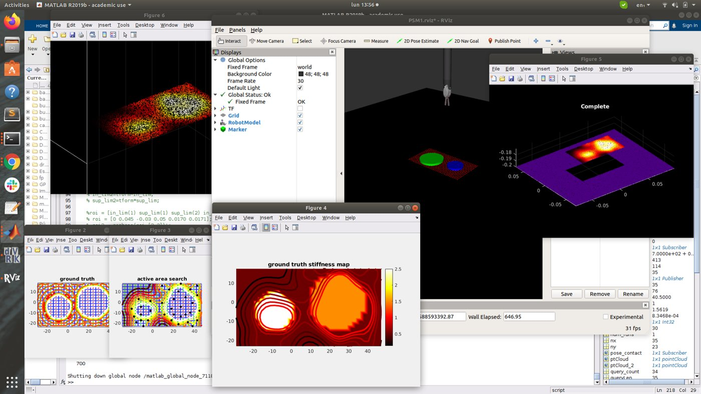
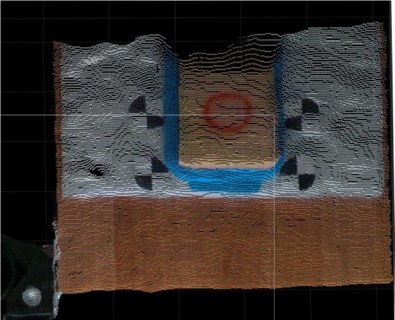
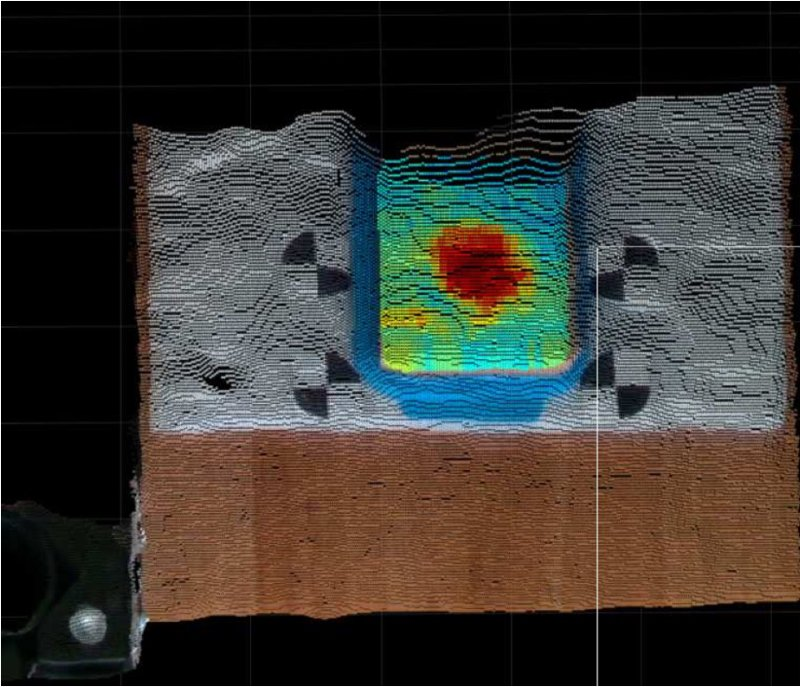
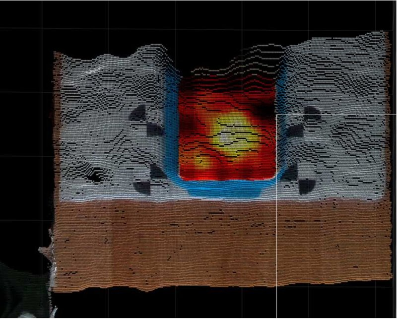

<a href="../">← All projects</a>

Project 4 · Medical robotics

# Tumor localization by bioimpedance palpation

A surgical robot finds a tumor by touch: the shape is recovered with only 25–50% of the samples, with recall above 90%.

dVRK PSM2ROSRVizMATLABGaussian ProcessElectrical bioimpedanceRealSense

| | |
|---|---|
| **Motivation** | Replace computer vision for locating a tumor and estimating its shape, aiming at a minimally invasive intervention |
| **Robot** | da Vinci Research Kit (dVRK), patient-side manipulator PSM2 |
| **Sensing** | Electrical bioimpedance (EBI) probe in direct tissue contact |
| **Planner** | Gaussian Process, active area search (MATLAB) |
| **Result** | Tumor shape reconstructed with 25–50% of the samples, recall >90% against ground truth |
| **Context** | Visiting researcher, Altair Robotics Laboratory, Verona (Jan – Jul 2020) |

<figure><figcaption>Experimental setup: dVRK PSM2 palpating a sponge phantom with fiducial markers</figcaption></figure>

## The pipeline

1 · 3D acquisition<small>ROI point cloud and optical markers</small>

⟶

2 · Kinematics & simulation<small>dVRK PSM2 control in RViz / ROS</small>

⟶

3 · Robotic palpation<small>EBI probe in direct tissue contact</small>

⟶

4 · Active planner<small>Gaussian Process (MATLAB)</small>

⟶

5 · Map & validation<small>ground truth vs estimate</small>

The justification is to **replace artificial vision** for locating and estimating the shape of a tumor, aiming at a minimally invasive intervention. The dVRK manipulator palpates the tissue directly, and the bioimpedance reading tells stiff, abnormal tissue from healthy tissue.

## Simulation first: kinematics and a 20×20 sampling grid

As a first step I configured the **sensor driver in simulation** and built a simulation setup (a ROS-based emulator of the EBI sensor), so the software could be validated before any physical trial.

<figure><figcaption>Digital model of the da Vinci arm in RViz</figcaption></figure>
<figure><figcaption>400-point grid with the simulated tumor (green cylinder)</figcaption></figure>

- The **arm and its end effector are modeled digitally**, with kinematic control of safe trajectories and verification of the workspace.
- **ROS nodes synchronize** sensors, manipulator and planner.
- The area to explore is discretized in a **20 × 20 grid (400 points)** for the impedance sweep. This gives the algorithm the spatial base for deciding **which cells actually need palpation**.

## Active sampling with Gaussian Processes

I verified the algorithm based on **active area search** and compared it with the ground truth. A Gaussian Process models tissue stiffness (impedance) and **picks the next point to palpate**. It reconstructs the shape of the tumor using only **25 to 50 percent of the samples**, with a **recall above 90 percent**. The estimate is then projected onto a point cloud.

<figure><figcaption>Ground truth stiffness map vs active area search, with the RViz and MATLAB views</figcaption></figure>

## 3D validation: the estimate reproduces the tumor core

<figure><figcaption>3D surface map: depth sensor, 4 fiducial markers, circular region of interest</figcaption></figure>
<figure><figcaption>Ground truth: exhaustive impedance map over the 3D relief</figcaption></figure>
<figure><figcaption>Planned estimate: reduced samples, same position and shape</figcaption></figure>

Both maps capture the central anomaly with high geometric fidelity. The red-yellow core is the **high-stiffness, high-impedance region** that corresponds to the tumor, and the exhaustive ground truth is the base for computing recall. The estimate preserves the position and concentric shape of the tumor, with a smooth transition toward the edges.

This validation needs **point-cloud processing and camera calibration**. The four **fiducial markers** calibrate the camera, and the estimated tumor is overlaid on the 3D point cloud captured by an Intel RealSense depth sensor.

!!! note "About the tissue"
    There are no experiments with organic tissue yet. On a **sponge phantom** I used liquid soap and water to obtain different impedance readings.

<a href="../tiago-pro/">← Previous: TIAGo Pro</a><a href="../formation-control/">Next: Formation control →</a>

